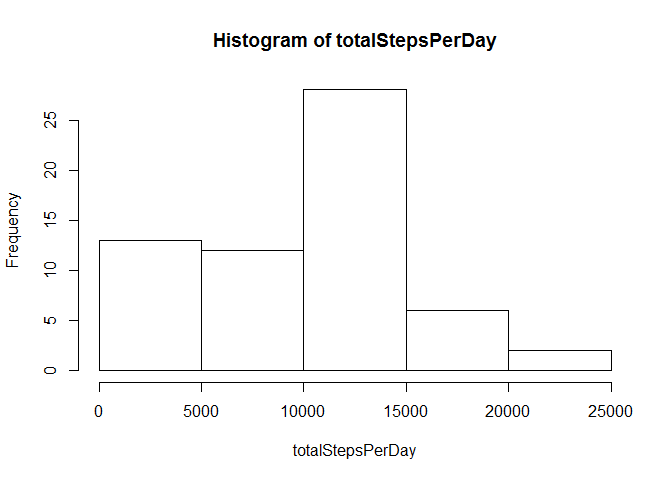
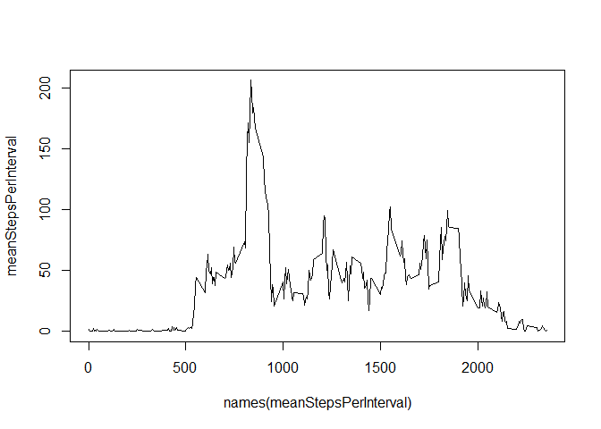
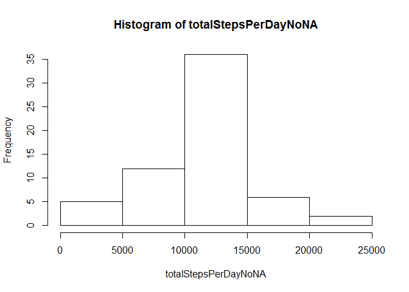
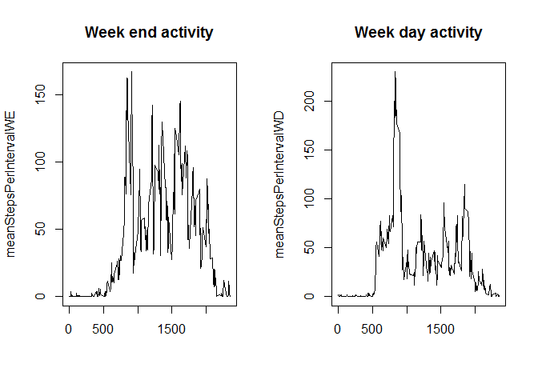

# Reproducible Research: Peer Assessment 1


## Loading and preprocessing the data

```r
unzip("activity.zip")
df<-read.csv("activity.csv")
```


## What is mean total number of steps taken per day?
### Histogram of total number of steps taken per day

```r
totalStepsPerDay<-tapply(df$steps,df$date,sum,na.rm=TRUE)
hist(totalStepsPerDay)
```

<!-- -->

### Mean and median of steps taken per day


```r
mean(totalStepsPerDay)
```

```
## [1] 9354.23
```

```r
median(totalStepsPerDay)
```

```
## [1] 10395
```


## What is the average daily activity pattern?
### Average daily pattern

```r
meanStepsPerInterval<-tapply(df$steps,df$interval,mean,na.rm=TRUE)
plot(x=names(meanStepsPerInterval),y=meanStepsPerInterval,type='l')
```

<!-- -->

### Five minutes interval with most average number of steps

```r
which(meanStepsPerInterval == max(meanStepsPerInterval, na.rm = TRUE))
```

```
## 835 
## 104
```


## Imputing missing values
### Total number of rows with NA values

```r
nrow(df[is.na(df$steps),])
```

```
## [1] 2304
```

### Creating new data set with NA values filled in

```r
dfNAReplaced<-df
for (i in 1:nrow(dfNAReplaced)) {
  if(is.na(dfNAReplaced$steps[i])){
    dfNAReplaced$steps[i]<-meanStepsPerInterval[as.character(dfNAReplaced$interval[i])]
  }
}
```

### Creating the histogram for the number of steps each day and calculating the mean and median

```r
totalStepsPerDayNoNA<-tapply(dfNAReplaced$steps,dfNAReplaced$date,sum,na.rm=TRUE)
hist(totalStepsPerDayNoNA)
```

<!-- -->

```r
mean(totalStepsPerDayNoNA)
```

```
## [1] 10766.19
```

```r
median(totalStepsPerDayNoNA)
```

```
## [1] 10766.19
```

The values change. We can see that the total number of steps per day goes up when NA values are replaced


## Are there differences in activity patterns between weekdays and weekends?
### Creating the new factor variable

```r
library(chron)
```

```
## Warning: package 'chron' was built under R version 3.3.2
```

```r
dfNAReplaced["day"]<-NA
dayDate<-as.Date(dfNAReplaced$date)
for (i in 1:nrow(dfNAReplaced)) {
  if(is.weekend(dayDate[i])){
    dfNAReplaced$day[i]<-"weekend"
  }
  else{
    dfNAReplaced$day[i]<-"weekday"
  }
}
dfNAReplaced$day<-as.factor(dfNAReplaced$day)
```

### Generating the new plot

```r
meanStepsPerIntervalWE<-tapply(dfNAReplaced[dfNAReplaced$day=="weekend",]$steps,dfNAReplaced[dfNAReplaced$day=="weekend",]$interval,mean,na.rm=TRUE)
meanStepsPerIntervalWD<-tapply(dfNAReplaced[dfNAReplaced$day=="weekday",]$steps,dfNAReplaced[dfNAReplaced$day=="weekday",]$interval,mean,na.rm=TRUE)
par(mfrow =c(1,2))
plot(x=names(meanStepsPerInterval),y=meanStepsPerIntervalWE,type='l',main = "Week end activity",xlab = "")
plot(x=names(meanStepsPerInterval),y=meanStepsPerIntervalWD,type='l',main = "Week day activity",xlab = "")
```

<!-- -->


